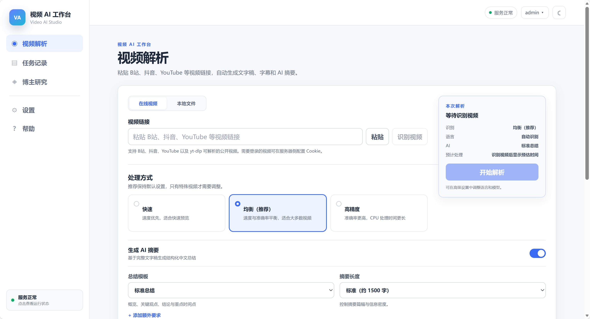

# 视频 AI 工作台（Video AI Studio）

一个可部署、可复用的中文视频内容解析产品。输入在线视频链接或上传本地媒体，即可获得带时间轴的文字稿、字幕和 AI 摘要。

<p align="center">
  
</p>

## 内容处理流程

```text
在线视频 URL / 本地视频或音频
          ↓
      来源识别 / 上传
          ↓
       FFmpeg 音频提取
          ↓
      faster-whisper ASR
          ↓
       带时间轴文字稿
          ↓
   AI 分块总结 + 分层归并
          ↓
 Markdown / TXT / SRT / JSON
```

## 核心功能

- 在线视频和本地视频、音频上传，支持在提交前识别视频标题、作者、封面、时长和平台。
- 基于 faster-whisper 的本地语音识别，提供快速、均衡和高精度三档处理策略。
- 支持标准总结、详细笔记、课程笔记、会议纪要、访谈整理、知识点提取和自定义 AI 摘要。
- 任务记录、实时进度、任务取消、全文检索和失败重试；文字稿完成后可单独重新生成摘要，无需重新下载或识别。
- 导出 Markdown、TXT、SRT 和 JSON；即使 AI 摘要失败，已生成的文字稿和字幕仍可读取、下载。
- 全中文界面，支持浅色和深色模式；API Key 加密保存，前端只展示掩码。

## 支持来源

### 在线视频

- B站
- 抖音
- YouTube
- 以及 yt-dlp 可解析的其他公开视频来源

需要登录的视频可通过服务器侧 Netscape Cookie 文件处理，Cookie 不进入源码。

### 本地文件

支持常见格式：

```text
视频：MP4 / MOV / MKV / WEBM / AVI / M4V
音频：MP3 / WAV / M4A / AAC / FLAC / OGG / OPUS
```

本地媒体上传到你的服务器处理。默认 `KEEP_SOURCE_MEDIA=false` 时，成功处理后会删除原始上传媒体和中间 WAV，仅保留最终结果。

## 技术架构

```text
React + Vite
     ↓
   Nginx
     ↓
  FastAPI
  ↙     ↘
PostgreSQL Redis
             ↓
           Celery
             ↓
        Video Worker
        ├─ yt-dlp
        ├─ FFmpeg
        ├─ faster-whisper
        └─ OpenAI-compatible LLM
```

Linux 是主要生产部署环境；Windows 推荐使用 Docker Desktop + Linux Containers。

## 部署

### 环境要求

- Docker Engine 和 Docker Compose v2
- 建议至少 4 GB 内存；CPU 使用 `small` 模型时建议更高配置
- 足够的磁盘空间用于模型缓存、上传文件和任务结果

### 启动服务

在项目根目录运行：

```bash
python3 scripts/init_env.py
docker compose up -d --build
```

`init_env.py` 会生成本地 `.env`，其中包括 `APP_SECRET_KEY`、`APP_ENCRYPTION_KEY`、`ADMIN_PASSWORD` 和 `POSTGRES_PASSWORD`，不会生成任何 LLM API Key。

检查服务状态：

```bash
docker compose ps
docker compose logs -f worker
```

浏览器访问：

```text
http://服务器IP:8080
```

登录后前往“设置 → AI 模型”，选择服务商并填写自己的 API Key。预置 DeepSeek、智谱 GLM，也支持自定义 OpenAI-compatible 接口。

Windows 可在 Docker Desktop（Linux Containers）中运行：

```powershell
py scripts\init_env.py
docker compose up -d --build
```

然后访问 `http://localhost:8080`。

## Cookie、配置与输出

需要登录的视频，请将 Netscape 格式 Cookie 放到：

```text
secrets/yt-dlp.cookies.txt
```

并在 `.env` 中配置：

```text
YTDLP_COOKIES_FILE=/run/secrets/yt-dlp.cookies.txt
```

`secrets/` 已被 `.gitignore` 排除；不要将 Cookie、LLM API Key 或本地 `.env` 提交到 Git。

### 抖音链接与 Cookie

支持抖音直链 `https://www.douyin.com/video/<视频ID>`，以及“精选”页分享链接
`https://www.douyin.com/jingxuan?modal_id=<视频ID>`；后者会在服务端自动转换为直链。

抖音通常要求新鲜的浏览器 Cookie，即使视频本身可以在浏览器中公开播放。请使用你有权使用的抖音账号按以下步骤配置：

1. 在 Windows 浏览器中登录 `douyin.com`，打开目标视频一次，并保持该浏览器会话有效。
2. 使用可信的 Cookie 导出工具，将 **douyin.com** 的 Cookie 导出为 Netscape `cookies.txt` 格式；不要把 Cookie 发给他人或上传到第三方网站。
3. 将导出的文件保存为 `secrets/yt-dlp.cookies.txt`。文件首行通常是 `# Netscape HTTP Cookie File`。
4. 在项目根目录的 `.env` 添加或修改：

   ```text
   YTDLP_COOKIES_FILE=/run/secrets/yt-dlp.cookies.txt
   ```

5. 重建后端和 Worker，使两者读取新的只读挂载文件：

   ```bash
   docker compose up -d --build backend worker
   ```

Cookie 会过期或因抖音风控失效；出现 “Fresh cookies … are needed” 或“需要登录”时，重新登录并导出新的文件后重启上述两个服务。请遵守抖音的服务条款、内容访问权限和适用法律。

每个任务默认输出到：

```text
/data/jobs/<job-id>/output/
├── result.md
├── transcript.txt
├── subtitles.srt
└── result.json
```

`result.json` 保存完整的结构化时间轴，因此即使原始媒体已清理，也能重新生成 AI 摘要。

## 安全与生产建议

- LLM API Key 通过 `APP_ENCRYPTION_KEY` 加密保存；请妥善备份该密钥，丢失后旧 Key 无法解密。
- 视频 URL 会拦截私网、回环和保留 IP，降低 SSRF 风险；上传文件也受扩展名白名单和大小限制保护。
- 公网部署请使用 Caddy、Nginx 或 Traefik 等反向代理配置 HTTPS，示例见 `deploy/Caddyfile.example`。
- 默认资源限制包括 `DOWNLOAD_MAX_HEIGHT=1080`、`MAX_VIDEO_DURATION_SECONDS=14400` 和 `MAX_DOWNLOAD_BYTES=8589934592`，可在 `.env` 中按需调整。

## 开源许可

本项目采用 [MIT License](LICENSE)。
